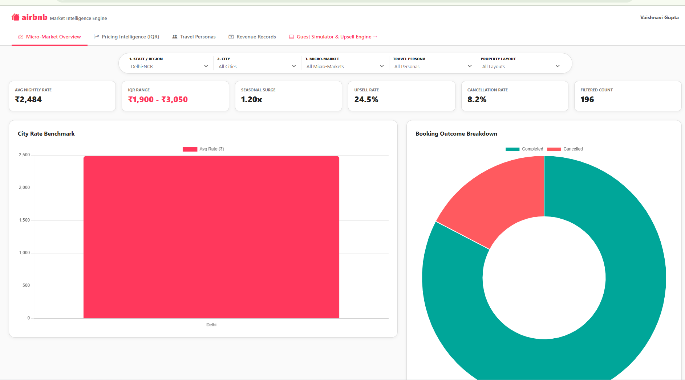
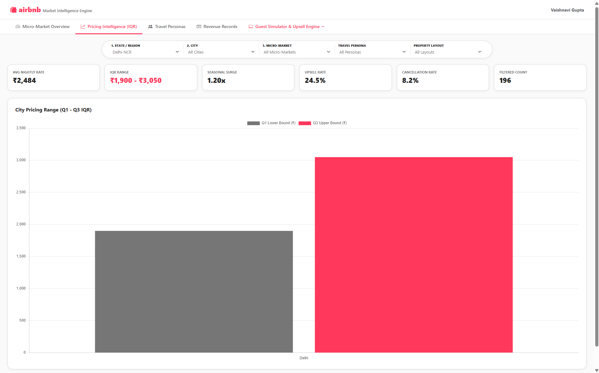
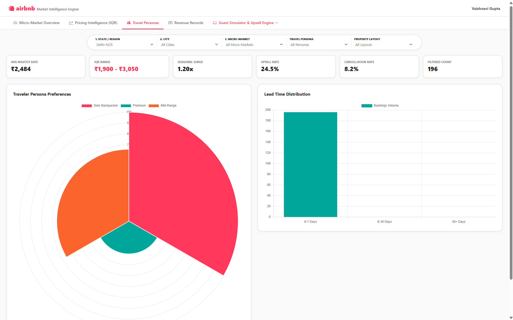
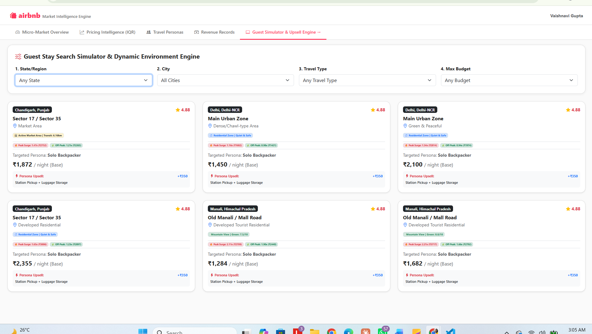

# 🏡 North India Airbnb Pricing & Revenue Analysis Platform

> **Why one "average price" is misleading, and what to show customers instead.**

[](https://vaishnavi698.github.io/North-India-Airbnb-Pricing-Revenue-Analysis-Platform/)
[](https://github.com/Vaishnavi698/North-India-Airbnb-Pricing-Revenue-Analysis-Platform)

👉 **Try it now (no install needed):** https://vaishnavi698.github.io/North-India-Airbnb-Pricing-Revenue-Analysis-Platform/


*The live dashboard: filters, KPI cards and price charts in one view.*

---

## 📖 Contents
1. [The problem in plain English](#-the-problem-in-plain-english)
2. [What this project does](#-what-this-project-does)
3. [Key ideas](#-key-ideas)
4. [What the dashboard shows](#-what-the-dashboard-shows)
5. [The Guest Simulator & Upsell Engine](#-the-guest-simulator--upsell-engine)
6. [How to use it](#-how-to-use-it)
7. [Tools used](#-tools-used)
8. [Full analysis notes](#-full-analysis-notes)
9. [About me](#-about-me)

---

## 🧩 The problem in plain English

Say a city's **average** Airbnb price is **₹5,000 a night**.

- A guest looking at a **₹2,500** room thinks *"Great, I found a bargain!"*
- A guest paying **₹8,000** for a luxury villa thinks *"Am I being overcharged?"*

**Both reactions are wrong,** because the average compares things that shouldn't be compared:

| These are NOT the same | Why |
|---|---|
| A posh locality vs. a nearby ordinary one | Location changes the price |
| Himachal on a **long weekend** vs. an **off-season weekday** | Season and demand change the price |
| A farmhouse in **holidays** vs. a normal weekend | Events change the price |
| A ₹2,500 private room vs. an ₹8,000 luxury villa | Different property types and guests |

> **One average price doesn't work for every customer or every property.**

---

## 🎯 What this project does

It looks at Airbnb-style stays across **Delhi-NCR, Himachal Pradesh and Punjab** and answers:

1. **What is a fair price** for *this kind* of property, in *this* place, at *this* time?
2. **What drives prices up or down?** (location, property type, season, demand)
3. **What kind of traveller** is looking for what kind of stay?
4. **What should we suggest** to each traveller, without making anyone feel cheap or overcharged?

---

## 💡 Key ideas

### 1️⃣ Compare like with like
Instead of one city-wide average, prices are shown **per city, micro-market, property type and traveller type**, using a **typical price range** (the middle chunk of prices, ignoring extreme luxury or bargain outliers).

> Example: *"Similar stays in this segment usually cost ₹2,300–₹2,800"* is far more useful than *"the city average is ₹5,000"*.

### 2️⃣ Every region behaves differently
Delhi, Himachal and Punjab don't behave the same way. Mountain prices spike in vacations and long weekends, farmhouses spike in holidays, and city apartments react to events. So the project **compares regions separately**.

### 3️⃣ Seasons matter, and the data should show it
Rather than assuming "New Year is always the highest," the project shows the **seasonal surge from the data** so patterns are discovered, not assumed.

### 4️⃣ Different travellers, different needs

| Traveller type | What they usually want |
|---|---|
| 🎒 **Solo Backpacker** | Affordable, simple, good location |
| 🙂 **Mid-Range** | Good balance of price and comforts |
| 💎 **Premium** | Quality, privacy, amenities over lowest price |

> Travellers are grouped by **what they search and choose**, never by stereotypes.

### 5️⃣ Upsell the right way
- A **budget** traveller sees where their price sits versus similar stays.
- A **premium** traveller is **never shown a cheaper option** just because it's cheaper. They see *"for ₹500 more, you get a bigger room with better amenities."*

The suggestion always answers *"what would this guest actually value?"*, **not** *"how do we make them spend more?"*

---

## 📊 What the dashboard shows

The live dashboard has **five sections**:

| Section | What you'll find |
|---|---|
| 🗺️ **Micro-Market Overview** | Average nightly rate, price range, seasonal surge, upsell rate, cancellation rate |
| 💰 **Pricing Intelligence** | Fair price range for each city and segment |
| 🧳 **Travel Personas** | What each traveller type prefers |
| 📋 **Revenue Records** | Recent booking offers (city, micro-market, persona, rate, status) |
| 🎮 **Guest Simulator & Upsell Engine** | Try it as a guest and see the recommendations |

### Filters you can play with
- **State / Region:** Delhi-NCR · Himachal Pradesh · Punjab
- **City** and **Micro-Market**
- **Travel Persona:** Solo Backpacker · Mid-Range · Premium
- **Property Layout:** Cottage/Homestay · Entire home/apt · Farmhouse · Hotel room · Private room · Shared room

### Charts inside
City rate benchmark · Booking outcome breakdown · City pricing range · Traveller persona preferences · Booking lead-time distribution

### 💰 Pricing Intelligence

*Fair price ranges per city and segment, instead of one misleading average.*

### 🧳 Travel Personas

*What Solo Backpacker, Mid-Range and Premium travellers prefer.*

### 📋 Revenue Records

*Recent booking offers by city, micro-market, persona, rate and status.*

---

## 🎮 The Guest Simulator & Upsell Engine

Pretend to be a guest. Pick:

1. **State / Region**
2. **City**
3. **Travel Type** (Solo Backpacker, Mid-Range, Premium)
4. **Max Budget** (under ₹4,000 / ₹7,000 / ₹10,000)

The engine then suggests stays that fit, and shows **relevant upgrade ideas** for that type of traveller.


*The Guest Simulator: pick a region, city, travel type and budget to see relevant stays.*

---

## ▶️ How to use it

**Easiest way:** open the [live demo](https://vaishnavi698.github.io/North-India-Airbnb-Pricing-Revenue-Analysis-Platform/). Nothing to install.

**Run it on your computer:**

```bash
# 1. Download the project
git clone https://github.com/Vaishnavi698/North-India-Airbnb-Pricing-Revenue-Analysis-Platform.git
cd North-India-Airbnb-Pricing-Revenue-Analysis-Platform

# 2. Open index.html in your browser
```

---

## 🛠️ Tools used

**Python** · **HTML / JavaScript dashboard** · **GitHub Pages** (free hosting for the live demo)

<!-- TODO: add any other tools you used (SQL, charts library, etc.) -->

---

## 🗂️ About the data

<!-- TODO: add 1–2 lines: where the data comes from (e.g. sample/synthetic data created for this project, or a public dataset) and roughly how many records. Recruiters like this to be clear. -->

---

## 📚 Full analysis notes

Want to see **how I thought about the problem** in detail, including regional behaviour, seasons, customer types and the recommendation logic?
👉 Read [`docs/PROJECT_DETAILS.md`](docs/PROJECT_DETAILS.md)

---

## 🔮 Ideas for the future

- **A/B test** different price messages for budget vs. premium guests (measure clicks, bookings, upsell acceptance)
- Build traveller profiles from **real search and filter behaviour**
- Add safety and neighbourhood information (night transport, nearby attractions)
- Extend to more states and cities

---

## 👩‍💻 About me

**Vaishnavi Gupta**, aspiring Data Analyst · New Delhi, India

[LinkedIn](https://www.linkedin.com/in/vaishnavi-gupta-0a8076213/) · [GitHub](https://github.com/Vaishnavi698) · [LeetCode](https://leetcode.com/u/Vaishnavi-guptaa) · vaishnavigupta97929@gmail.com

⭐ If you found this useful, please star the repo!
