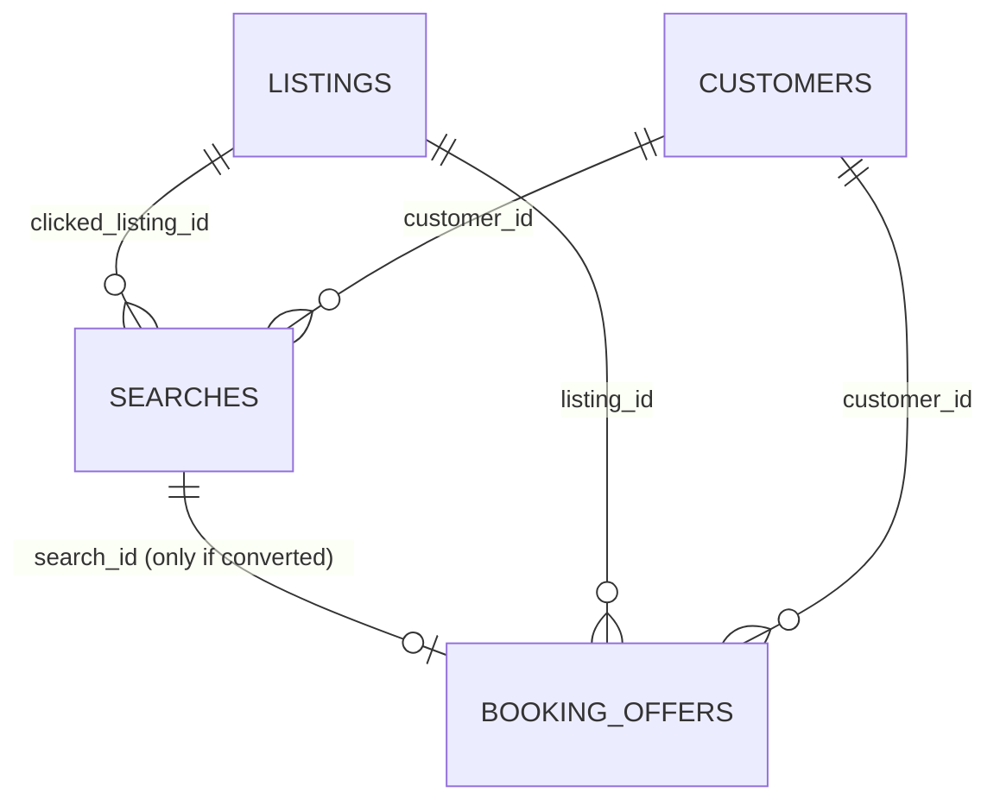

# North India Airbnb Analytics — Data Model & Dictionary

This replaces the single flat CSV with a small relational model: one master
**property/listing table** plus three **behavioural tables** (who searched,
what they searched for, and what happened when they tried to book). This is
what turns the project from a pricing dashboard into a customer + market
analytics project.

Files:
| File | Grain | Rows |
|---|---|---|
| `listings_master.csv` | 1 row per property | 3,900 |
| `customers.csv` | 1 row per customer | 600 |
| `searches.csv` | 1 row per search event | 1,232 |
| `booking_offers.csv` | 1 row per completed booking (subset of searches that converted) | 502 |

---

## 1. `listings_master.csv` — what changed vs. the previous version

| Column | Status | Notes |
|---|---|---|
| `target_customer_segment` | **RENAMED** → `property_target_segment` | This is a *property attribute* ("who this listing is designed for"), not an observed customer. The real, behaviour-derived customer segment now lives in `customers.csv`. |
| `neighbourhood_avg_price`, `price_vs_area_avg_pct` | **KEPT** | Still drives the value-reassurance vs. upsell display logic — it's a deliberately simple flat benchmark for that specific product decision. |
| `comp_group_definition`, `comp_group_size`, `comp_group_q1`, `comp_group_median`, `comp_group_q3`, `comp_group_iqr`, `price_position_vs_comp_group` | **ADDED** | A proper peer-group IQR benchmark: `city + neighbourhood + room_type + property_category` (falling back to broader groupings when fewer than 5 comparable listings exist, so every row has a real ≥5-listing peer group). Tells you if a listing is priced *within, below, or above* genuinely comparable stock — much more defensible than "the neighbourhood averages ₹X." |
| Everything else (`region`, `area_tier`, `mult_*` / `price_*` seasonal columns, `girls_safety_score`, `crowd_level`, `aesthetic_score`, `cab_availability_night`, `pricing_display_strategy`, `upsell_addon_suggested`, etc.) | **KEPT unchanged** | Already covered the region/season/area-tier/pricing-psychology requirements. |
| Search/booking/customer fields (budget, filters, lead time, cancellations, repeat behaviour, offer acceptance) | **REMOVED from this table** → moved to the three new tables below | These are events, not property attributes — they don't belong on the listing row. |

**Caveat to state explicitly in your README:** `mult_*` / `price_*` columns are
**scenario-based assumptions** you designed (e.g. "Himachal spikes ~2x on New
Year"), not prices observed from a real market. Frame it as *"I modeled how
pricing could respond to demand periods"* — not as a discovered fact.

---

## 2. `customers.csv` — who is searching

| Column | Description |
|---|---|
| `customer_id` | Primary key (`C0001`…) |
| `customer_name` | Synthetic name |
| `customer_segment` | **Budget / Mid-Range / Premium** — paying capacity, distinct from `property_target_segment` on listings |
| `budget_min`, `budget_max` | Customer's typical nightly budget band |
| `typical_guests` | Party size |
| `trip_purpose` | Weekend Getaway / Couple Getaway / Family Trip / Solo Trip / Corporate Trip / Friends Trip |
| `preferred_region` | Delhi-NCR / Punjab / Himachal Pradesh / No Preference |
| `prioritizes_safety` | Yes/No — feeds the safety-filter behaviour in searches |
| `prioritizes_amenities` | Yes/No — Premium customers skew Yes |

---

## 3. `searches.csv` — what they actually searched for

| Column | Description |
|---|---|
| `search_id` | Primary key (`S000001`…) |
| `customer_id` | FK → `customers.csv` |
| `search_date`, `check_in_date`, `lead_time_days` | When they searched vs. when they'd travel |
| `travel_event` | Regular / New Year / Diwali / Valentine / Holi / Long Weekend / Summer Vacation / Wedding Season — links directly to the `mult_*` columns on `listings_master.csv` |
| `destination_region` | Delhi-NCR / Punjab / Himachal Pradesh |
| `budget_min`, `budget_max`, `guests` | Search-time filters |
| `room_type_filter`, `category_filter`, `amenity_filter` | Property filters applied |
| `safety_priority_filter` | Yes/No |
| `clicked_listing_id` | FK → `listings_master.csv` — the listing they engaged with |
| `converted` | Yes/No — whether this search became a booking |

Conversion probability (~41% overall) is modeled from price-fit-to-budget and
listing rating — not random, so you can genuinely analyze *"which filters /
segments convert best."*

---

## 4. `booking_offers.csv` — what happened at the point of booking

Only exists for `searches.converted == 'Yes'`.

| Column | Description |
|---|---|
| `booking_id` | Primary key (`B000001`…) |
| `search_id`, `customer_id`, `listing_id` | FKs tying the booking back to the search, customer, and property |
| `booking_date`, `check_in_date`, `nights`, `travel_event` | Stay details |
| `base_price_at_booking`, `seasonal_multiplier_applied` | Price mechanics at the moment of booking |
| `displayed_pricing_strategy` | Copied from the listing's `pricing_display_strategy` |
| `offer_shown` | The exact upsell line shown (or "Area Average Shown" for value-segment customers — nothing is upsold to them) |
| `offer_addon_price`, `offer_accepted` | Whether the upsell was taken |
| `final_total_price` | `(base_price × seasonal multiplier + accepted addon) × nights` |
| `booking_status` | **Completed** or **Cancelled** (~17% cancellation rate). Cancellation likelihood is modeled from lead time, region (Himachal carries a weather-risk premium), customer segment (Budget cancels more), and steep seasonal surcharges. |
| `cancellation_date` | Blank unless cancelled; falls between `booking_date` and `check_in_date`. |
| `cancellation_reason` | Blank unless cancelled: Change of Plans / Found Cheaper Option / Personal Emergency / Weather Concern (Himachal only) / Price Increase Post-Booking (only for steep seasonal surcharges). |

**This is the table that answers your original business question.** Offer
acceptance by segment shows the pattern you predicted: Premium customers
accept upsells **~57%** of the time, Mid-Range **~26%**, Budget **~10%**.

Be precise about how you describe this: it is **not** a true A/B test —
there's no `experiment_id` / control-vs-treatment split in the data, the
offer shown is *determined by* each listing's `pricing_display_strategy`
and each customer's segment, not randomly assigned. Describe it as:
*"Compared upsell acceptance rates across customer segments under different
pricing-display strategies"* — not *"an A/B test proved…"*. If you want a
genuine A/B test later, that needs an explicit control/treatment field added
on top of this.

---

## 5. The four analytical questions this now supports

1. **Market & pricing** — `listings_master.csv`: is a property priced fairly vs. its true peer group (IQR), not just its raw neighbourhood?
2. **Seasonal pricing** — `mult_*`/`price_*` columns: how does the *same* property's price move across events, and how does that differ by region?
3. **Customer behaviour** — `customers.csv` + `searches.csv`: what are people actually filtering for, by segment and by region?
4. **Personalized commercial strategy** — `booking_offers.csv`: given the display strategy shown, who takes the upsell — and does it match the segment-based hypothesis?

All four tables share consistent, verified foreign keys (no orphan rows, no
nulls) and are ready to join directly in SQL or pandas.

---

## 6. Deliberately left out (and why)

| Idea raised | Decision | Reason |
|---|---|---|
| Repeat-customer / retention history | **Not added** | 600 customers × 1–4 searches each doesn't give any customer enough booking history to study first-time vs. repeat behaviour meaningfully. Only add this if the project's scope becomes retention analysis specifically. |
| True A/B experiment fields (`experiment_id`, control/treatment) | **Not added** | The current model already demonstrates the segment → strategy → acceptance mechanism convincingly. Add this only if you specifically want to claim a controlled experiment. |

## 7. Observed vs. synthetic fields — state this explicitly in your README

| Category | Examples | How to describe it |
|---|---|---|
| Structural / source-like fields | `region`, `city`, `neighbourhood`, `room_type`, `base_price`, `comp_group_*` (IQR) | Modeled to resemble real listing data and computed with standard statistics (quartiles) — defensible as "real" analysis technique applied to synthetic data. |
| Scenario/assumption fields | `mult_*` / `price_*` seasonal columns | Explicitly scenario assumptions you designed, not observed market prices. |
| Behavioural/simulation fields | `searches.csv`, `booking_offers.csv` (conversion, offer acceptance, cancellation) | Simulated from a defined probability mechanism (price-fit, segment, region, lead time) — present as *"I modeled how these behaviours could respond to X"*, not as discovered facts. |

## 8. Project naming

The data now spans Delhi-NCR + Punjab + Himachal Pradesh, so the content is
accurately **North India**, not just NCR. Two reasonable options:
- Keep the GitHub repo name `delhi-ncr-airbnb-analytics` as-is (avoids link/URL
  churn) but title the write-up **"Delhi-NCR Airbnb Market & Pricing
  Analytics — Extended to Regional Scenario Analysis Across North India."**
- Or rename the public project to **"North India Airbnb Market & Pricing
  Analytics"** if you're comfortable with the repo/URL change.
Either is defensible — the second is cleaner long-term, the first avoids
touching a URL you may have already shared.
